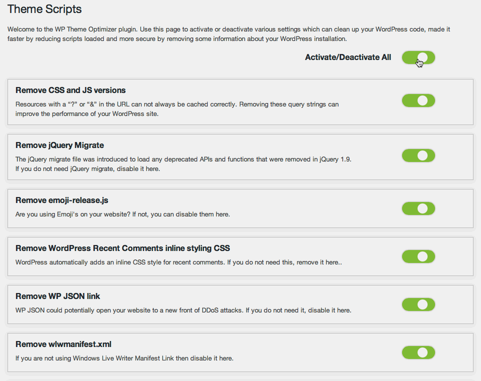

WP Theme Optimizer
======================

[](https://packagist.org/packages/dsgnr/wp-theme-optimizer)
[](https://packagist.org/packages/dsgnr/wp-theme-optimizer)
[](https://packagist.org/packages/dsgnr/wp-theme-optimizer)


This WordPress plugin allows you to optimize your WordPress theme header by removing excess tags and scripts.


## Installation

Either download this repository from Github and upload it to your 'plugins' folder via FTP, or go to the WordPress repository and download direct from your dashboard, <a href="https://en-gb.wordpress.org/plugins/wp-theme-optimizer/">here</a>

### via Command-line

If you're using Composer to manage WordPress, add WP Theme Optimizer to your project's dependencies.

```sh
composer require dsgnr/wp-theme-optimizer
```

### How it works?

I have enabled a simple checkbox for easy activation/deactivation of features. A small gif below:




### Features

* Remove CSS and JS versions<br>
* Remove WP Generator tag<br>
* Remove OEmbed Links<br>
* Remove jQuery Migrate<br>
* Remove emoji-release.js<br>
* Remove recent comments inline CSS<br>
* Remove RSD Link<br>
* Remove RSS feeds<br>
* Remove wlwmanifest.xml<br>
* Remove WP JSON link<br>
* Remove WP Shortlink<br>
* Remove Next/Previous post links<br>
* Remove Yoast SEO comments in front-end HTML<br>
* Option to Minify front-end HTML<br>
* Remove DNS prefetch tags<br>


## Contributing

Contributions are welcome from everyone. If this plugin is missing anything you'd like to see, or have found a bug please tell us!

* <a href="https://github.com/dsgnr/WP-Theme-Optimizer/issues">Submit an issue</a>
* <a href="mailto:email@danielhand.io">Email me</a>
